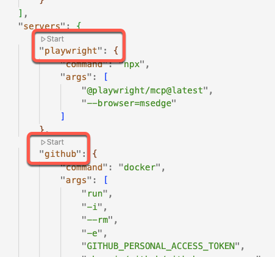

# **GitHub Copilot Agent Mode & MCP Demo**

This demo app can be used to show a number of Copilot features:

- **Agent Mode and Vision**: generate a fairly complex UI updated (add the Cart functionality to the site) all with a natural language prompt and an image
- **Unit Testing**: run and generate unit tests to improve coverage
- **MCP Server**: 
  - generate a `.feature` file (Behaviour Driven Development/Tesing file)and use Playwright to launch a browser and test the scenario
  - Interact with GitHub via the GitHub MCP server
- **Custom instructions**: personalize how Copilot responds by pointing to a fictional private observability framework that Copilot can work with, even though it is not a public library
- **Security**: 
  - Enable GHAS scans on the repo, and after finding a vulnerability, generate an autofix
  - Ask GitHub to find vulnerabilities in the code, then explain and fix them
- **Actions**: generate Actions workflows for deploy/publish
- **Infrastructure as Code**: generate Bicep or Terraform files for publishing
- **Padawan (SWE Agent)**: You can also ask Copilot to code via Padawan for some of the above scenarios by logging issues and assigning them to Copilot

### **About Up the Demo**

- **About the App:** This is a modern TypeScript web-app with separate API and Frontend (React) projects that you will enhance with Copilot Agent Mode, Vision, MCP Servers and GHAS/Actions.
- **Why:** Demonstrate how Copilot can analyze and enhance existing code automatically, understand images, vulnerabilities and testing and how you can extend Copilot's capabilities with MCP server.
- **Demos**: You don't have to do all these demos, or do them in order. Get comfortable with the scenarios and practice them and then mix/match according to your audience.
- **MCP Servers**: The GitHub MCP server runs via Docker. You will need to install Docker locally to run it (it should work fine in a Codespace automatically). I use Podman for my Mac. Install this _before_ you attempt this demo! You'll also need a PAT that has enough permissions for your demos. Details below.
- **Padawan**: If you want to use Padawan, you have to ensure that it is enabled on the repo, that Actions are enabled and that you have a branch protection rule for `main`. I recommend creating a PR required for changes to Default branch with 1 required reviewer.
- **Local vs Codespaces:**  
  - This demo can work in a Codespace - but some scenarios (like running Playwright tests) require that you work in a local VSCode (clone the repo locally)
  - The visibility of the API port (3000) must be set to `public`. I have set this in the port attributes of the devcontainer file, but it seems that this config setting isn't always obeyed. Check before the demo! If you forget this, you will see CORS errors when the frontend tries to reach the API.
  - Make sure you **PRACTICE** this demo _before_ trying it in front of customers
  - Remember, Copilot is non-deterministic so you can't always predict exact behavior. Make sure you are comfortable with this environment so you can pivot quicky!
  - You don't have to use **VS Code Insiders** Version unless you want to demo features that you know are in preview.
    - If you want to access the Insiders Version in the web-version of a Codespace, click on the gear-icon on the bottom-left and select `Switch to Insiders Version...`

  

### **Building, Running and Debugging the code**

Refer to [the build docs](./build.md).

### **Full end-to-end Azure Deplyment Demo (optional)**

This demo requires the following:
- `az cli` and `gh cli` for configuring the Azure environment as well as the repo (Environments and vars, as well as OIDC config)
- You will need an Azure Subscription, of which you have owner permissions
- To configure the environment, run `az login` and make sure you have selected the correct subscription.
- Run the following command: `./infra/configure-deployment.sh <repo-name>` and make sure that it completes successfully. If it does, you will have:
  - An Azure Service Principal, correctly configured for deployment
  - 2 Azure Resource Groups (one for Prod and one for Staging)
  - an Azure Container Registry (in the prod resource group)
  - 2 Environments in the Repo (Staging, Prod) with manual approval configured on Prod
  - Actions Variables - all the vars that are needed to run the workflows
  - OIDC configuration - the script configures OIDC connection for the repo/environments so you don't have to store any secrets in GitHub!

> **Note**: as an alternative, you can just generate the Bicep and Workflow files without actually executing them.

### **MCP Server install and config (optional)**

> You can skip the MCP Server demos if you want to, so this is optional. Also, you can run the GitHub MCP Server demo just fine in a Codespace, but will need Docker (or Podman or equivalent) to run the GitHub MCP Server locally. Also, the Playwright MCP Server demo will not work in a Codespace since it has to open a browser.

If you are wanting to show MCP server integration, you will need to set up and configure the MCP servers _prior_ to the demo. I have included the necessary `mcp` config in the [mcp.json](../.vscode/mcp.json) file. Open the file and use the HUD display above the servers to start them:



You can also use the Command Palette to start the MCP servers.

#### Start the Playwright MCP Server

- Use the cmd palette `Cmd/Ctrl + Shift + P` -> `MCP: List servers` -> `playwright` -> `Start server`

##### Start the GitHub MCP Server

> Generate a fine-grained PAT that has permissions to read/write Issues and PRs, context and whatever other features you want to demo. You can create this at the org/repo level. I suggest creating a PAT and storing it in a key vault (or 1Password) so that you have it handy.

- This server runs via Docker image, so you will need Docker to be installed and running before starting this server. I use Podman on my Mac.
- Use the cmd palette `Cmd/Ctrl + Shift + P` -> `MCP: List servers` -> `github` -> `Start server`. The first time you run this, you will have to supply a PAT.

> **Pro tip:** If you want to change the PAT, open the Settings json file. You will see `"id": "github_token" = ****` in the `input` section. Right-click on the `***` section to edit or clear the cached token. (The `***` is a GUI feature - the value is not actually stored in the json file)

### **Demo: Prompt Files**
- **What to show:** Reusing prompts to streamline AI-native workflow
- **Why:** Demonstrate how Copilot and VSCode use prompts to help streamline AI-native workflows and keep developers in the flow.
- **How:**  
  1. Show the [model.prompt.md](../.github/prompts/model.prompt.md) file in the prompts directory. Note that it has a URL reference to the official GitHub docs!
  1. Open Copilot Chat
  1. Hit `Cmd/Ctrl P` -> `Chat: Use prompt` -> `model`
  1. Enter this prompt:
    ```txt
    Help me select the best model for adding a cart icon and simple cart page to the frontend
    ```
  1. Show at the output
  1. **Note:** You don't have to use the models suggested - just explain that you always have a choice!

### **Demo: Using Vision and Agent to Generate Cart Functionality**  

- **What to show:** "Vibe coding" using Agent Mode and Vision to complete complex tasks.
- **Why:** Demonstrate how Copilot Vision can detect design and how Agent can understand a codebase and create complex changes over multiple files.
- **How:**  
  1. Run the App to show the original code. Once the site starts, click on "Products" in the NavBar and show the Product Page. Add an item to the Cart - note that nothing actually happens, except a message saying, "Added to Cart". Explain that there is no Cart in the frontend app currently.
  1. (OPTIONAL if you have the GitHub MCP Server configured): Ask Copilot to `create an issue in my repo to implement the Cart page and Cart icon`
  1. Show the issue in the repo
  1. Open Copilot and switch to "Ask" mode. Add the `plan` prompt to the chat.
  1. Attach the [cart image](../docs/design/cart.png) using the paperclip icon or drag/drop to add it to the chat.
  1. Enter the following prompt:
    ```txt
    I need to implement a simple Cart Page. I also want a Cart icon in the NavBar that shows the number of items in the Cart.
    ```
  1. Highlight that Copilot has suggested changes and planned the components to add/modify and even asked clarifying questions.
  1. Answer some of the questions if you want to refine the plan.
  1. Switch to "Agent" mode in Copilot Chat. Switch to `Claude 3.5 Sonnet` (a good implementation model) and enter this prompt:
    ```txt
    Implement the changes.
    ```
  1. Show Copilot's changes and how you can see each one and Keep/reject each one.
  1. Accept Copilot’s suggested fixes.
  1. Go back to the Frontend app. Navigate to Products. Show adding items to the cart (note the icon updating). Click on the Cart icon to navigate to the Cart page. Show the total, and adding/removing items from the cart.

### **Demo: MCP Servers - Playwright**  

- **What to show:** Launch browser navigation using Playwright MPC server to show functional testing from natural language. Show integration to GitHub via the GitHub MCP server.
- **Why:** Demonstrate support for extending Copilot capabilities using MCP server protocol.
- **How:**  
  1. Add the `feature` prompt to the Chat.
  1. Ask Copilot to `generate tests for the Cart functionality and the icon`.
  1. Show how it creates a meaningful test feature file.
  1. Ask Copilot to `browse to http://localhost:5137 and execute the test steps`
  1. Accept the Playwright command requests and show Copilot "running" the test.
  1. (Optional): Ask Copilot `to generate headless Playwright tests for the .feature file`

### **Demo: MCP Servers - GitHub (Optional)**  

- **What to show:** Interact with GitHub from Chat.
- **Why:** Demonstrate support for extending Copilot capabilities using MCP server protocol as well as the GitHub MCP server.
- **How:**  
  1. Switch to Agent mode
  1. Ask Copilot to `check which issues are assigned to me in the repo`. 
  1. Note: you may have to expand the args (using the `>` symbol`) and ensure that the org/repo name are correct! You can edit them if they are not.
  1. Show how Copilot fetched issues (or shows there are no issues)
  1. Ask Copilot to `create an Issue for enhancing test coverage in the API project and assign it to me`. (Don't forget to check the owner/repo in the args!)
  1. Show how Copilot creates a new Issue with a meaningful description and labels
  1. (Optional): Assign the issue to Copilot to queue off Padawan!

### **Demo: Enhancing Unit Tests and Coverage**  

- **What to show:** Copilot generating a multiple tests, exucuting them, analyzing coverage and self-healing.
- **Why:** Show Copilot’s ability to quickly and easily generate tests, validate them, self-heal and analyze coverage.
- **How:**  
  1. Ask Copilot to `run tests, analyze coverage and add missing Branch tests to include tests for untested scenarios`
  1. Show Agent working on the tests and adding new tests for the API Branch route
  1. Show Copilot "self-healing" (if tests fail)
  1. Accept the changes
  1. Ask Copilot to `add tests for the Product route` to show generation of new tests

### **Demo: Automating Deployment with GitHub Actions, Azure and Bicep**  

- **What to show:** Copilot generating Actions workflows and Infrastructure-as-code.
- **Why:** Show Copilot’s ability to automate CI/CD workflows.
- **How:**  
  1. Ensure that you have run the [configure-deployment.sh](../infra/configure-deployment.sh) script to set up the initial infrastructure and configure the environments and vars in the repo.
  1. Add the [deployment.md](../docs/deployment.md) file as context.
  1. Prompt Copilot Agent to `generate bicep files and workflows according to the deployment plan`
  1. Show generated files:  
     - GitHub Actions YAML to build & test
     - GitHub Actions YAML to deploy including an approval step
  1. Accept the changes
  1. Commit and push to see the pipeline execution
  1. Show the deployment

### **Demo: Custom instructions**

- **What to show:** Copilot’s **Custom instructions** feature.
- **Why:** Demonstrate that Copilot can be customized and personalized, including internal libraries that do not exist in the foundational models.
- **How:**  
  1. Create an empty file: `.github/copilot-instructions.md`
  1. Enter the following content:
    ```markdown
    # Guidelines for REST APIs
    
    For REST APIs, use the following guidelines:
    
    * Use descriptive naming
    * Add Swagger docs for all API methods
    * Implement logging and monitoring using [TAO](../docs/tao.md)
      - assume TAO is installed and never add the package
    ```
  1. Mention how there are best practices as well as a doc reference to the TAO framework (a fictional library). Open the [TAO](./tao.md) doc to show the library.
  1. Ask Copilot to `add observability to the Supplier route`.
  1. Show the changes - note that _this will not compile_ since TAO doesn't really exist!
  
### **Demo: Copilot and App Security**

- **What to show:** Copilot’s ability to understand and remediate security vulnerabilities
- **Why:** Demonstrate that Copilot can be used to scale AppSec by bringing security expertise to Developers directly.
- **How:**  
  1. Open Copilot Chat and switch to `Ask` mode.
  1. Ask Copilot to `analyze @workspace and check if there are obvious security vulnerabilities`
  1. You should see issues like:
    - Cross-site Scripting (XSS) vulnerability
    - Command Injection Vulnerability
    - Insecure CORS Configuration
    - Missing Security Headers
    - Insecure Authentication Implementation
  1. Chat with Copilot to address one of these issues: `generate a fix for ...`
  1. (Optional with GitHub MCP Server): Ask Copilot to `create an issue to fix ...` and select a vulnerability for Copilot to create an Issue

### **Demo: GHAS and Autofix**

- **What to show:** GHAS Autofix (our first platform AI agent)
- **Why:** Demonstrate that Autofix is built into the platform using Copilot.
- **How:**  
  1. Open the repo, navigate to settings and enable Code scanning
  1. The scan should return at least 1 vulnerability
  1. Show "Generate fix" and how that can auto-generate a fix
  1. Show how you can Chat about this vulnerability and fix in Chat

## **Key Takeaways for Customers**  

- Agent Mode handles multi-step changes across multiple files — saving time.
- Vision enables Copilot to understand images
- Command execution allows Copilot to self-heal and run commands
- MCP support extends Copilot with additional capabilities (and gracefully handles credentials without having to hard-code tokens!)
